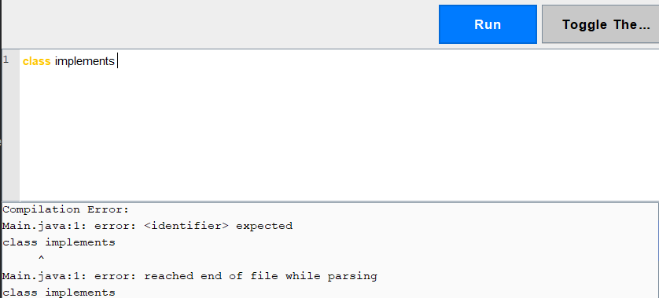
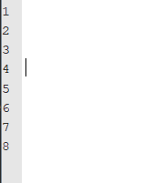
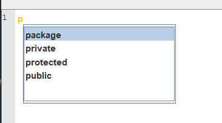
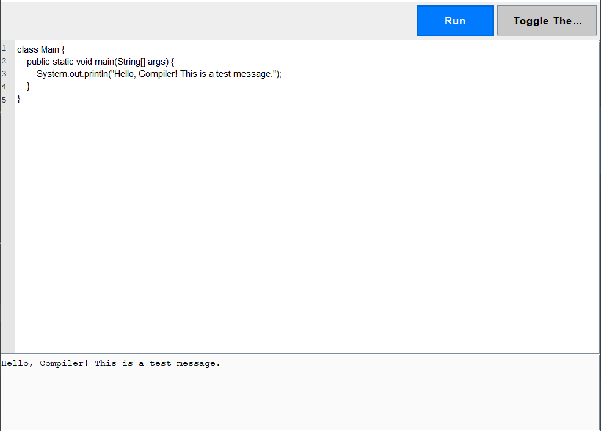
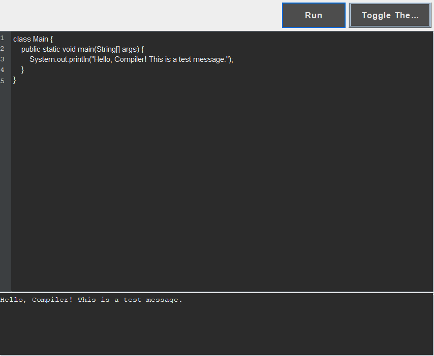

# JavaCodeEditor

# Advanced Java Text Editor with Autocomplete, Syntax Highlighting, and Code Execution

## Overview

This project is an Java-based text editor with rich features such as syntax highlighting, line numbering, autocomplete functionality, autosave, and the ability to execute code using the Judge0 API. It provides a modern, user-friendly editor with features that cater to developers and programmers.

### Key Features
- **Syntax Highlighting**: Highlights keywords, comments, and modifiers for better code readability.

  
- **Line Numbering**: Automatically numbers lines to aid navigation.

  
- **Autocomplete**: Suggests keywords as you type, with support for navigation using arrow keys and mouse clicks.

  
- **Code Execution**: Sends code to the Judge0 API for execution and displays results.
  
  
- **Autosave**: Automatically saves the editor content every 2 minutes.
- **Light/Dark Mode**: Switches between light and dark themes dynamically with proper text and background updates.
  
  
- **Current Line Highlighting**: Visually indicates the line where the caret is located.

---

## Use Cases

### 1. **Write and Run Code**
- Write Java code in the editor.
- Click the "Run" button to send the code to the Judge0 API for execution.
- The output of the code is displayed in the output area below the editor.

### 2. **Get Autocomplete Suggestions**
- Type a prefix (e.g., "pub") to see autocomplete suggestions for relevant keywords (e.g., "public").
- Navigate suggestions using arrow keys or by double-clicking with the mouse.
- Press `Enter` to insert the selected suggestion into the editor.

### 3. **Autosave**
- Automatically saves the editor content to a file every 2 minutes.
- Ensures that no work is lost in case of accidental closure.

### 4. **Switch Between Light and Dark Modes**
- Toggle between a visually distinct Light and Dark mode using the "Toggle Theme" button.
- Properly adjusts text and background colors for readability.

### 5. **Syntax Highlighting**
- Highlights keywords like `public`, `private`, and `class` for better readability.
- Comments and modifiers are displayed in distinct colors to help identify code structures easily.

---

## Application Flow

### 1. **Initialization**
- The `Gui` class initializes the application:
  - Sets up the main components: text editor, line numbering, output area, and buttons.
  - Configures the syntax highlighting using `SyntaxHighlightTextPane` and line highlighting using `CustomTextPaneUI`.
  - Initializes the autocomplete popup (`AutoCompletePopup`) and binds it to the editor.
  - Starts the autosave functionality using `AutoSaveController`.

### 2. **Autocomplete Workflow**
- When the user types, the `KeyListener` in the `Gui` class captures the input.
- The prefix (last word) is extracted and sent to the `AutoCompleteTrieController` to fetch suggestions.
- The `AutoCompletePopup` displays the suggestions in a dropdown menu near the caret position.
- The user can navigate the suggestions using arrow keys or select one using `Enter` or a double-click. The selected suggestion replaces the prefix in the editor.

### 3. **Code Execution**
- Clicking the "Run" button sends the editor content to the `Judge0Controller`.
- The `Judge0Controller` uses the `Judge0API` to submit the code for execution.
- The result (output, errors, or compilation details) is fetched and displayed in the output area.

### 4. **Autosave**
- The `AutoSaveController` periodically saves the editor content to a file (`autosave_output.txt`) every 2 minutes.
- Ensures data persistence in case of unexpected interruptions.

### 5. **Light/Dark Theme Toggle**
- Clicking the "Toggle Theme" button inverts the color scheme of the editor.
- Updates text, background, and component colors for readability.

---

## Project Structure

### **Controllers**
- **`Judge0Controller`**: Handles interaction with the Judge0 API to execute code.
- **`AutoCompleteTrieController`**: Manages the autocomplete trie for keyword suggestions.
- **`AutoSaveController`**: Manages the autosave functionality.

### **Application**
- **`SyntaxHighlightTextPane`**: Extends `JTextPane` to add syntax highlighting for keywords, comments, and modifiers.
- **`CustomTextPaneUI`**: Extends `BasicTextPaneUI` to highlight the current line where the caret is located.

### **Presentation**
- **`AutoCompletePopup`**: Displays autocomplete suggestions in a popup menu.
- **`Gui`**: The main graphical user interface class, integrating all features into a cohesive application.

---

## How to Run

1. Clone the repository:
   ```bash
   git clone https://github.com/your-username/your-repository.git
   cd your-repository

